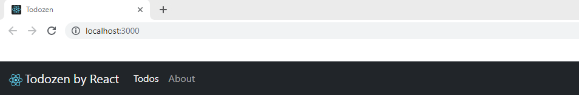

# React Tutorial - Todo app


## Introduction

**Setup**

- Install **NodeJs** = JS Runtime -- It will install NPM and NPX too
- **NPM** - Manages packages but doesn't make life easy executing any. NPM by itself does not simply run any package. It doesn't run any package as a matter of fact. If you want to run a package using NPM, you must specify that package in your package.json file.
- **NPX** - A tool for executing Node packages. `npx` will check whether `<command>` exists in `$PATH`, or in the local project binaries, and execute it.

```sh
$ node --version (JS Runtime )
v14.18.0

$ npm --version (npm = package manager)
6.14.15

$ npx --version ()
6.14.15
```

**Added Extension** in VS Code : `ES7+ React/Redux/React-Native snippets`


**Create react App**

The below line will generate a `react` app boilerplate *within* the path the command had run in, and ensures that you always use the latest version of a generator or build tool without having to upgrade each time you’re about to use it.

```sh
$ npx create-react-app my-app
$ cd my-app
$ npm start
```

- React use JSX (JavaScript Syntax Extension to design any app)

- In React , **class** should be renamed as **className** 

- You can view app by using below links : 

  ```sh
  You can now view todozen in the browser.
  
  Local:            http://localhost:3000
  On Your Network:  http://192.168.0.105:3000 (Visible to all devices of same WiFi network)
  ```


**Adding Bootstrap** 

***index.html***

```html
CSS
<link href="https://cdn.jsdelivr.net/npm/bootstrap@5.1.3/dist/css/bootstrap.min.css" rel="stylesheet" integrity="sha384-1BmE4kWBq78iYhFldvKuhfTAU6auU8tT94WrHftjDbrCEXSU1oBoqyl2QvZ6jIW3" crossorigin="anonymous">

JS
<script src="https://cdn.jsdelivr.net/npm/@popperjs/core@2.10.2/dist/umd/popper.min.js" integrity="sha384-7+zCNj/IqJ95wo16oMtfsKbZ9ccEh31eOz1HGyDuCQ6wgnyJNSYdrPa03rtR1zdB" crossorigin="anonymous"></script>
<script src="https://cdn.jsdelivr.net/npm/bootstrap@5.1.3/dist/js/bootstrap.min.js" integrity="sha384-QJHtvGhmr9XOIpI6YVutG+2QOK9T+ZnN4kzFN1RtK3zEFEIsxhlmWl5/YESvpZ13" crossorigin="anonymous"></script>
```


## Components

- Added other components link in App Component

  ***App.js***

  ```react
  import './App.css';
  import { Footer } from './Components/Footer';
  import Header from './Components/Header';
  import { Todos } from './Components/Todos';
  
  function App() {
    return (
      <>
      <Header/>
      <Todos/>
      <Footer/>
      </>
    );
  }
  
  export default App;
  ```

- Added Folder `Components` and add `Header.js` in it. 
- Created a Function based component using `rfc`


### Header

Steps :

1. Copy Navbar from bootstrap website

2. For error like this : `JSX element 'input' has no corresponding closing tag` , we need to add a `/` before ending `>` like below : 

   ```html
   <input className="form-control me-2" type="search" placeholder="Search" aria-label="Search">
   <hr className="dropdown-divider"/>
   ```

3. Rename `class` with `className`

4. Rename `for` with `htmlFor`

***Header.js***

```react
import React from 'react'

export default function Header(props) {
  return (
    <nav className="navbar navbar-expand-lg navbar-dark bg-dark text-light">
      <div className="container-fluid">
        <a className="navbar-brand" href="#">
            
            {props.title}
        </a>
        <button className="navbar-toggler" type="button" data-bs-toggle="collapse" data-bs-target="#navbarSupportedContent" aria-controls="navbarSupportedContent" aria-expanded="false" aria-label="Toggle navigation">
          <span className="navbar-toggler-icon"></span>
        </button>
        <div className="collapse navbar-collapse" id="navbarSupportedContent">
          <ul className="navbar-nav me-auto mb-2 mb-lg-0">
            <li className="nav-item">
              <a className="nav-link active" aria-current="page" href="#">Todos</a>
            </li>
            <li className="nav-item">
              <a className="nav-link" href="#">About</a>
            </li>
          </ul>
          {props.searchBar? <form className="d-flex">
            <input className="form-control me-2" type="search" placeholder="Search" aria-label="Search"/>
            <button className="btn btn-outline-success" type="submit">Search</button>
          </form> : ""}
        </div>
      </div>
    </nav>
  )
}
```


### React Props: parent to child

This is used to send data from Parent to Child component.

Using String Value **title** and using Boolean value **searchBar**

***App.js***

```react
<Header title="Todozen by React" searchBar={false}/>
```

***Header.js***

```react
export default function Header(props) {
	...
    // Showing string title, recieved from parent
    {props.title} // Prints the value from App.js
	...
    // Showing form against boolean value, recieved from parent
    { props.searchBar? <form className="d-flex">
         <input className="form-control me-2" type="search" placeholder="Search" aria-label="Search"/>
         <button className="btn btn-outline-success" type="submit">Search</button>
     </form> : "" }
```

**Snapshot - Designed Header**




**Prop-types and Default Props**

***Header.js***

```react
import PropTypes from 'prop-types'
...
// Default value will be provided , if no value proided from parent
Header.defaultProps = {
    title : "Your title here",
    searchBar : true
}

// Strict Type checking, this will throw error in console if String not received as title
Header.propTypes = {
    title : PropTypes.string,
    searchBar : PropTypes.bool.isRequired
}
```


### Displaying One Todo

***Todos.js***

```react
import React from 'react'
import { Todo } from './Todo'

export const Todos = (props) => {
  return (
    <div className="container">
        <h2 className='text-center my-3'>Todo List</h2>
        {/* {props.todos[0]} */}

        <Todo todo={props.todos[0]}/>
    </div>
  )
}
```

***Todo.js***

```react
import React from 'react'

export const Todo = ({todo}) => {
  return (
    <div className='my-3'>
      <h4>{todo.title}</h4>
      <p>{todo.desc}</p>
      <button className="btn btn-danger btn-sm">Delete</button>
    </div>
  )
}
```

**Snapshot - Displaying One Todo**


### All Todos- For loop in React

***Todos.js***

```react
...
{/* <Todo todo={props.todos[0]}/> */} // This is to display one todo

// For Loop for React
{props.todos.map((todo) => {
    return <Todo todo={todo}/>
})}
```


## Delete Todo

### Passing function: child to parent

***App.js***

Taking todo from Todo Component on deletion and print it into console.

```react
function App() {
	...
    const onDelete = (todo) => {
    console.log("Deleted Todo : ", todo);
  }
  return ( ...
      <Todos todos={todos} onDelete={onDelete}/>
	...
```

***Todos.js***

```react
{props.todos.map((todo) => {
    return <Todo todo={todo} key={todo.sno} onDelete={props.onDelete}/>
})}
```

***Todo.js***

Writing arrow function for `onDelete()` , so that it will pass function only, it doesn't pass the function while calling.

```react
export const Todo = ({todo, onDelete}) => { // Destructuring
	...
    <button className="btn btn-danger btn-sm" onClick={ ()=> {onDelete(todo)} }>Delete</button>
```


### DeleteTodo using State Hook

***App.js*** - used State hook of react to run setTodos function after delete. Imported `useState` and convert `let todos` into `const [todos, setTodos] = useState`

```react
import React, { useState } from "react";

function App() {
  // let todos = [ ==> Converting this variable into State Hook, so that it can be updated after any Add/Delete operation
  const [todos, setTodos] = useState([
    {
      sno: 1,
      title: "Go to the market",
      desc: "You need to go to market to get the work done",
    },
    ...
  ]);

  const onDelete = (todo) => {
    console.log("Deleted Todo : ", todo);

    // Deleting this way does not Work
    // let index = todos.indexOf(todo);
    // todos.splice(index, 1);

    setTodos(todos.filter((t) => {
        return t !== todo;
    }));
...
```


**No Todos to Display Functionality**
